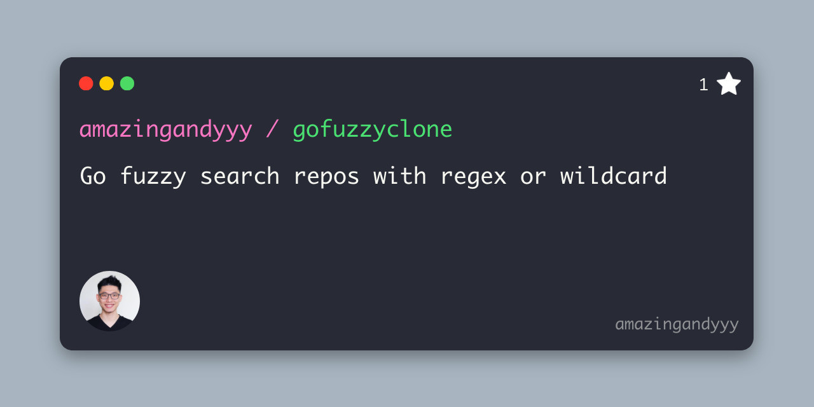

<p styles="font-size: 20rem" align="center">
    
</p>
<h1 align="center">
gofuzzyclone
</h1>
<h4 align="center">
Go fuzzy search repos with regex or wildcard and clone them
</h4>
<p align="center">
Never clone repos one by one
</p>

## Installation

It's easy!

```console
bash <(curl -sL https://raw.githubusercontent.com/amazingandyyy/gofuzzyclone/main/scripts/install.sh)
```

## Preparation

- [Generate a Github personal access token](https://github.com/settings/tokens/new?scopes=repo&description=gofuzzyclone-cli)
  - [repo] scrope
  - [no expiration]

## Usage

```console
# get instructions
gofuzzyclone -help

# regex mode
gofuzzyclone -owner amazingandyyy -search ".*-deployments$" -output ./code
# wildcard mode
gofuzzyclone -owner amazingandyyy -search "*-deployments" -mode wildcard -output ./projects

# interactive mode
gofuzzyclone
```

## Development

### Initialization

```console
git clone https://github.com/amazingandyyy/gofuzzyclone.git
cd gofuzzyclone
./scripts/setup
```

### Trigger pre-commit hook manually

```console
pre-commit run --all-files
```

---



## Contribution

- Try out this tool
- Star this repo
- Share with your friend!
- [Create issue](https://github.com/amazingandyyy/gofuzzyclone/issues/new)
- Create PRs

## Resources

- [regex101](http://regex101.com)
- wildcard

## LICENSE

[MIT](LICENSE)
